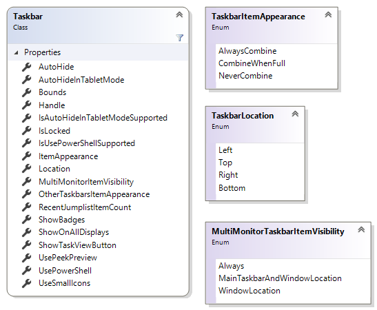

Zwirbelbart.Taskbar 
===================

Windows Taskbar Library.

Parts or theories based on these sources:
http://winsharp93.wordpress.com/2009/06/29/find-out-size-and-position-of-the-taskbar/

http://support.microsoft.com/kb/179908

http://www.pinvoke.net/default.aspx/user32.sendmessage